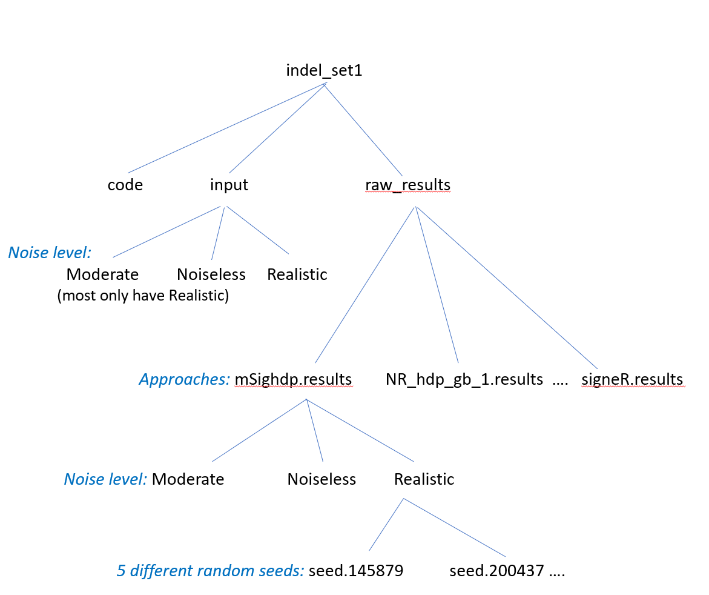

This repository contains supplementary files - synthetic data, code, and analytical results - 
for the paper

> Mo Liu, Yang Wu, Nanhai Jiang, Arnoud Boot, Steven G. Rozen,
> ***mSigHdp: hierarchical Dirichlet process mixture modeling for mutational signature discovery***, 

See https://github.com/steverozen/mSigHdp and https://github.com/steverozen/hdpx for mSigHdp.

### Directory structure

The main top-level folders are common_code, output_for_paper, and multiple folders, one for each dataset, e.g.  indel_set1.
(The …down_samp folders use the corresponding full datasets, e.g. indel_set1_down_samp uses the same data as indel_set1.)

#### Data set directories at the top-level
- indel_set1, indel_set2,
   `SBS_set1` and `SBS_set2` are the main synthetic data sets as documented in the paper.

-  indel_set1_down_samp, indel_set2_down_samp, `SBS_set1_down_samp` and
   `SBS_set2_down_samp` contain
   results of running mSigHdp with different downsampling thresholds
   on the synthetic data in indel_set1, indel_set2, SBS_set1, and SBS_set2.
   
- sens_SBS35_*x*_728 and sens_SBS35_*x*_1066 Data with SBS35
  "spiked into" *x* tumors"; see Supplementary Figure S10.

#### Structure of one dataset directory
This is the organization of a top-level data folder, using indel_set1 as an example. The …down_samp folders do not have the input subdirectory. They use the corresponding full datasets, e.g. indel_set1_down_samp uses the same data as indel_set1.

### License
 
 Copyright (C) 2022 Steven G Rozen, Mo Liu, and Yang Wu

 Code and data in this repository are free software: you can redistribute them and/or modify
 them under the terms of the GNU General Public License as published by
 the Free Software Foundation, either version 3 of the License, or
 (at your option) any later version.

 This code and data are distributed in the hope that they will be useful,
 but WITHOUT ANY WARRANTY; without even the implied warranty of
 MERCHANTABILITY or FITNESS FOR A PARTICULAR PURPOSE.  See the
 GNU General Public License for more details.

 You should have received a copy of the GNU General Public License
 along with this code and data at 
 https://github.com/Rozen-Lab/Liu_et_al_Sup_Files/blob/main/gpl-3.0.txt.
 If not, see <http://www.gnu.org/licenses/>.
    
